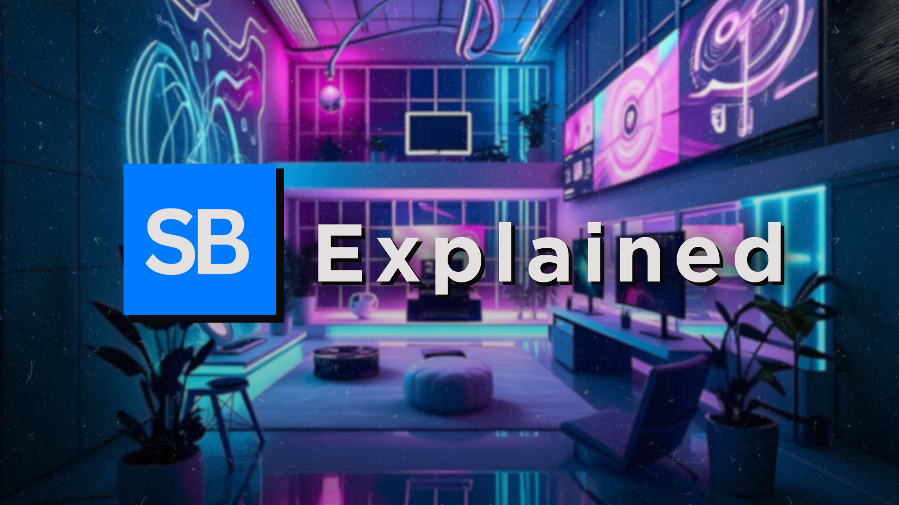

# Storyboard-AI

**Storyboard-AI** is an AI-driven storytelling platform designed to help users craft engaging, multimedia-rich narratives effortlessly. Featuring an interactive chatbot interface, the platform collects user inputs, generates personalized stories, and creates accompanying visuals, offering a seamless and immersive storytelling experience. With features like saving, editing, and narrating stories, Storyboard-AI empowers users to bring their creative ideas to life.

## Demo Video - Click on Thumbnail to View

[](https://drive.google.com/file/d/15OE9N4smv5QnfcbAWfTU90g2Ev27vM1b/view?usp=sharing)

## **Key Features**

- **Interactive Chatbot Interface**  
  A conversational chatbot guides users through the storytelling process, collecting inputs like themes, characters, and plot details.  

- **AI-Generated Stories**  
  Automatically generates complete, personalized narratives enhanced with custom AI-generated visuals.  

- **Multimedia Integration**  
  Enriches stories with visually engaging images and animations for enhanced storytelling.  

- **Read-Aloud Functionality**
  Adds an auditory layer to storytelling, allowing users to listen to their narratives.  

- **Editable Content**  
  Features like paragraph rewriting and copy options provide flexibility for refining stories.  

- **Save and Share**  
  Stories, along with images and metadata, can be saved locally as PDFs for easy sharing and future reference.  


## **Technical Details**

### **Frontend**
- **Technologies Used**: HTML, CSS, JavaScript, and localStorage ensure responsive and interactive user experiences.  
- **Dynamic UI Design**: Incorporates smooth animations and intuitive layouts for seamless navigation.  

### **Backend**
- **Framework**: Built with Python Flask to manage user inputs, story generation, and multimedia processing.  
- **Data Management**: User inputs and generated content are securely stored locally in JSON files to ensure privacy.  

### **Media Generation**
- **Image Creation**: AI-generated visuals are integrated into stories to enhance creativity and engagement.  
- **Interactive Animations**: Adds a dynamic touch, making the storytelling experience immersive and professional.  


## **Motivation**

**Storyboard-AI** was developed to meet the increasing demand for creative tools that simplify storytelling. Its mission is to empower individuals, educators, and content creators to transform their ideas into captivating narratives with minimal effort. By seamlessly combining text, visuals, and multimedia elements, the platform serves as a versatile tool for personal projects, educational purposes, and entertainment.

The platform emphasizes **accessibility**, **interactivity**, and **creativity**, enabling users of all technical expertise levels to generate professional-quality content with ease.


## **Getting Started**

## Clone the repository:
  ```bash
    git clone https://github.com/AFLucas-UOM/Storyboard-AI.git
  ```

## To Start the Server for Local Devices
  ```bash
  flask --app flask-app run
  ```


## Acknowledgments

This project was developed as part of the `ARI3333` course at the `University of Malta`.


## Contact

For inquiries or feedback, please contact [Andrea Filiberto Lucas](mailto:andrealucasmalta@gmail.com) & [Sean David Muscat](mailto:seanmuscat@outlook.com)
